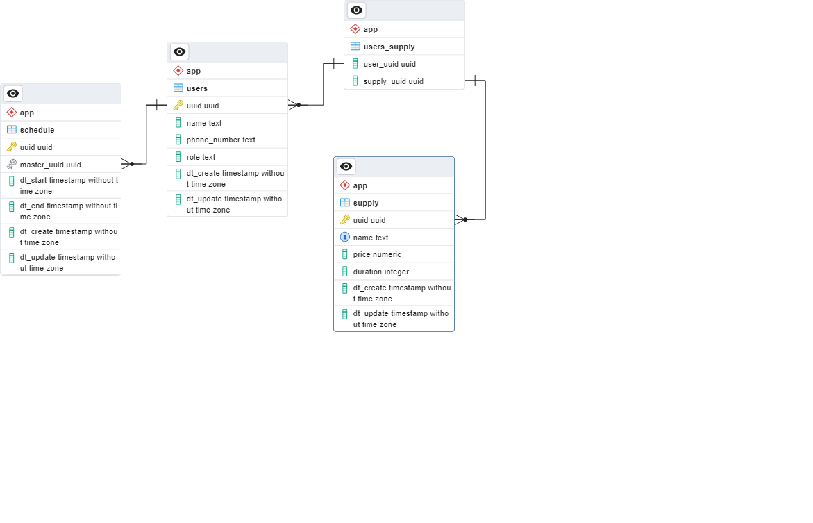

# Тема проекта: Управление графиком и услугами

## Описание функционала:

Система управления услугами, графиком и пользователями это системы 

1. Создание, удаление, обновление и просмотр пользователей.
2. Создание, удаление, обновление и просмотр услуг.
3. Создание, удаление, обновление и просмотр графика.

## Инструкция по запуску проекта в Docker

Для запуска проекта в Docker потребуется:
- apache-maven-3.9.4;
- Docker.

- Выполните команду 'mvn package' в корневой директории;
- Выполните команду 'docker-compose up' для сборки проекта в docker;
- Для просмотра урлов доступен open api file по адресу http://localhost:81
- Для доступа к базе данных доступен PGAdmin по адресу http://localhost:82
   - Логин: admin@admin.com
   - Пароль: root
   - Пароль к серверам: q1w2e3r4
- Модель базы данных:

         
   